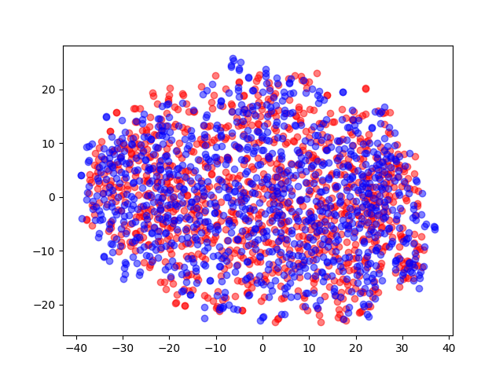

# Idea
This project is a proof of concept for implementing and training the comb model from the [paper](https://studios.disneyresearch.com/2020/06/29/high-resolution-neural-face-swapping-for-visual-effects/).
The interesting part of this deepfake model is the layer wise pretraining proposed in the paper. 
It makes training slightly faster and more stable. 
Additionally, the model supports the training of multiple identities at once. 
This feature is reflected in the naming of the model, as the structure of one single encoder to many decoders looks like a comb.

# How deepfakes work (very basic)
The underlying model for deepfakes is pretty basic encoder-decoder networks (aka autoencoder).
They map (encode) an input image to a shared latent space and try to decode the image from the feature vector of the latent space.
For training, we just optimize the network so that the input image is reproduced at the output of the network.
Each identity (person) needs to be passed through and separate decoder.
Once the training is finished, we can produce a deepfake by passing in an identity and decoding it by a decoder that was not trained to reproduce that exact identity.

# Preprocessing data
As seen in the _how deepfakes work_, the model itself is very basic.
The magic of deepfakes works only by providing good and normalized data.
What is normalized data? 
Good question.
If I find a good blog post, I will link it.

For deepfakes we can approximate "normalized" data by saying that all crops of faces need to be of the same size.
An additional feature that is helpful is to keep essential facial landmarks in the same area of the images.
For my tests I used the features of [DeepFacesLab](https://github.com/iperov/DeepFaceLab) for creating datasets.

# Training
In my experiments I used input images together with a mask for the facial region.
The mask is applied after the model forward process so that the optimizer only focuses on the part inside the mask.
## Training results
**TODO** Here will be some training results.

### Goal of the training
In order to produce deepfakes we need a network that will map multiple identities to the same latent space.
This makes it possible to input an image of person A and produce a similar looking image of person B (orientation & expression).
The utility `latent_debug.py` can be used to visualize the latent space of a trained network.
Ideally the latent space will look similar to the image below:

Here the (reduced) latent encodings are overlapping strongly. 
This makes it possible to switch identities for almost all input data.

If the overlapping is only partial, then some input images might not work.
You can back trace the latent encoding to the input images in order to get an image of the missing data.
Sometimes it can help to add similar images to the other datasets and re-train.

_Feature Proposal:_
If you are interested (or if I have some spare time) you can develop an interactive tool to show images that are missing in the encoding of other identities.
# Try yourself
**TODO** One the training reproduces consistent results and _all_ the bugs are gone, I will write a short summary on how to test and train this comb model yourself.
